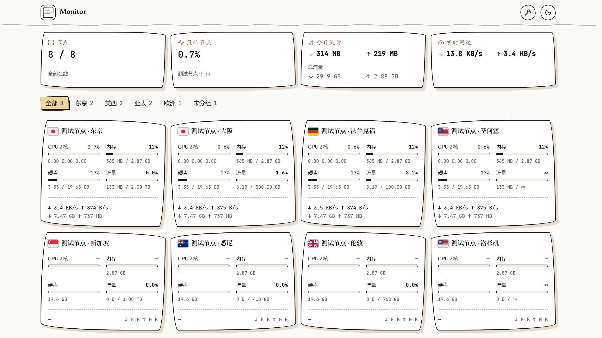
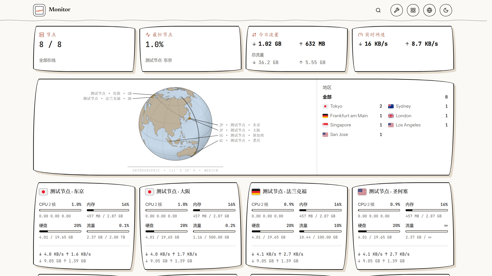
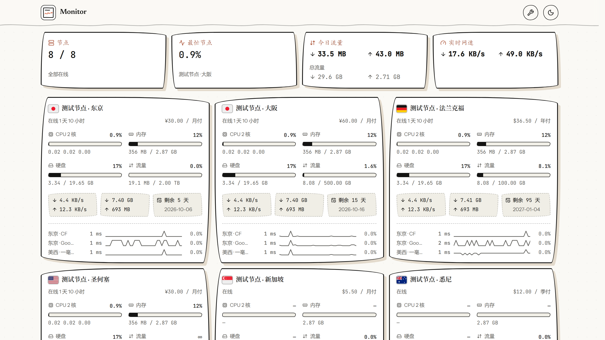
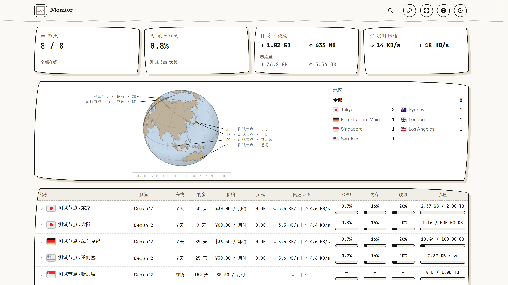

# rakugaki



极简探针（[Monitor](https://github.com/monitor-probe/monitor)）的第三方主题，源码基于上游默认主题
`monitor-theme-default` v1.1.0 改造。纯静态前端，只读 hub 的公开接口，
国旗、图标与字体都自带，离线可用。

**手绘纸感**：米白纸面、近黑墨线、歪歪扭扭的圆角、干净利落的硬偏移影子、一条手画的波浪线当分隔；
数字与单位走等宽字，像小票上那排读数。视觉语言参考 [cc-router](https://ccrouter.app/)，
代码与那个项目没有往来（见 [FONTS.md](FONTS.md) 的「视觉参考」一段）。

## 特性

- **五种卡片形态**：经典（速率与总量各一行）/ 简约（网络合成一行，标签提亮、进度条更细——默认）/ 延迟（下方带三网延迟）/ 详细（含备注标签与计费）/ 紧凑（一行一台的表格，点一行就地摊开延迟图）。
- **分组标签行与概览卡片行**（可选）：在线数、最忙节点、今日与累计流量、全站实时网速；概览卡片另有「月度预算 + 剩余价值」那一版。
- **节点详情页**：规格、7 天窗口的 CPU / 内存 / 网速 / 硬盘曲线，以及延迟图（多线路、丢包率、削峰、拖拽缩放）。
- **深浅两套配色**：纸白与「暖夜」，都是同一套墨线 + 陶土橙。
- **窄屏**：卡片、表格列、图表提示框都按屏宽收放，手机浏览器上一屏读得全。
- 只读公开接口，不需要登录；站长的设置存在 hub 里，访客端不落副本。

## 预览

五种卡片形态（默认是「简约」）：

| 简约形态（默认） | 经典形态 |
|---|---|
|  |  |
| 延迟形态 | 详细形态 |
|  |  |
| 紧凑形态 | |
|  | |

## 安装

首次安装需从 Releases 下载 theme.tar.gz 上传至探针后台，后续可在主题卡片上点击从 GitHub 更新。

## 主题设置

后台「主题」页的「主题设置」，改完对访客立即生效（值存在 hub 的站点配置里，访客端不落副本）：

| 设置项 | 默认 | 说明 |
|---|---|---|
| 站点图标 | `/site-icon.png` | 顶栏那枚 36px 方标的地址，同时也是浏览器标签页／书签／手机桌面快捷方式的图标。填完整网址或站内路径；取不到就回落到主题自带那张。 |
| 养鸡场入口 | 空（自动） | 顶栏那枚小鸟图标的去处，三种状态挤在一格里：留空 = 自动认本站 `/chicken/`（装了才显示）；填 `off` = 不显示入口（相关的探测与渲染都不再发生）；填地址 = 固定指向别处（同域路径或完整网址）。 |
| 列表页顶部 | 都不显示 | 列表页顶部显示什么，六选一：**都不显示**（默认）／**只显示分组标签**／**只显示概览卡片·原版**／**只显示概览卡片·价值版**／**两个都显示·概览卡片原版**／**两个都显示·概览卡片价值版**。分组标签 = 那一行「全部 / 各组 / 未分组」，节点本来就没有分组时无论如何都不显示；概览卡片 = 那行统计卡片，数据都取自节点列表本身、不多发请求，只有实时网速那张下面那条走势线画的是访客打开页面后的实时速率，刷新页面就从空的重新攒。原版是四张卡片各一块读数（节点在线数、最忙节点、今日与累计流量、全站实时网速）；月度预算剩余价值版把前两张各排两块读数——第一张是「月度预算」与「剩余价值」，第二张是「节点」与「最忙节点」（两块分居卡片两端）。**月度预算** = 各节点价格按计费周期摊到每月后相加；**剩余价值** = 已付但没用完的那一段（价格 × 剩余天数 ÷ 周期天数）；两者都按主题里写死的固定汇率折成人民币显示（因此写「≈」，口径与汇率在悬停提示里），一次性买断、没填价格、没有到期日的机器不计入。 |
| 卡片形态 | 简约 | 卡片长什么样，五选一：「经典」网络速率与总量分两行（2×2 四格）、不含延迟（也就不去拉延迟数据）；「简约」网络收成一行（左边实时速率、右边累计总量），读数那一层另换一套视觉——标签用墨色而不是弱化灰、进度条更细、底注更小、格行距更紧，同样不含延迟；「延迟」再加上三网延迟；「详细」在延迟之上再添在线时长、价格与到期；「紧凑」换成一行一台的表格（名称 / 系统 / 在线 / 剩余 / 价格 / 负载 / 网速 / CPU / 内存 / 硬盘 / 流量，列随屏宽收放、每个指标带一条细进度条），一屏能排下两三倍。**紧凑形态点一行就地展开**——展开行里挂的是那张带 1 / 6 / 24 小时 / 7 天范围与削峰开关的延迟图（不跳详情页），要去整页详情点展开行右上角的入口。五种形态配色与读数口径一致，只有信息多少与排布不同。 |
| 服务器备注 | 空（关闭） | 三种形态上的备注标签，每行一台：`服务器名=备注`；`#` 开头的行是注释，名字要和卡片上的一致；备注里用逗号分隔就是多枚标签（`东京机=三网优化,备用` 挂两枚）。留空 = 关闭，三种形态都保持原样。**「延迟」形态**——备注不进卡片正文，收在右上角那枚信息图标里：悬停（桌面）或点一下（手机）弹出浮层，里面是备注、在线时间、价格与到期；不点开时卡片与没有这枚图标时逐像素相同。**「详细」形态**——备注标签挂在**标题行右端**（名字右边），卡片其余部分一个像素都不动：在线时长仍在第二行左侧、价格仍在右侧、第三枚读数盒下面仍是到期日；标签排不下时在标题行里截断，不会把名字挤没、也不会把卡片撑高。 **「紧凑」形态**——备注收在展开行量程栏右端那枚小图标里（悬停或点一下摊开、点别处或 Esc 收起），不摊开时那一行与没有备注时逐像素相同；整页详情上也是同一枚。 |
| 显示的延迟线路 | 空（自动） | 卡片「三网延迟」里显示哪几条线路。每行一个 ping 任务名，最多三个，按填写的顺序显示；留空则按后台顺序自动显示前三条。名字对不上（改过名、任务删了）那一行跳过。仅在「延迟」「详细」「紧凑」形态下生效，数据每 60 秒刷新一次。 |

## 开发

```bash
npm ci
npm run dev            # 本地开发（没有 hub 时接口为空，页面仍会渲染骨架）
npm run build          # tsc -b && vite build
npm run package        # 打 release/theme.tar.gz（theme.json + LICENSE + FONTS.md + dist/ + preview.png）
```

`npm run check` 比对 `theme.json` 的设置项与代码里的默认值、缓存键是否两边一致；`npm test` 跑口径单测
（格式化、合计、预算、站点设置）。本机验收不必连远端 hub：

```bash
ssh -f -N -L 28081:127.0.0.1:28080 <hub 所在机器>          # 隧道（ssh -f 活得过 shell 回收）
node tools/shot_local.mjs http://127.0.0.1:28081 shots/x '{"listTop":"both"}'
```

静态资源走本机 `dist/`、`/api/*` 转给真 hub，一条命令拍完桌面亮暗、详情页与手机机位并回报 DOM 事实。
护栏脚本在本主题仓库 `tools/`：预览图取景（`shot_preview.mjs`）、卡片形态、设置对话框、站标与
标签页标题、详情页预取时机。

## 更新记录

| 版本 | 说明 |
|---|---|
| 1.2.0 | 延迟档右上角加一枚信息图标：悬停或点开弹出浮层，里面是这台机器的备注、在线时间、价格与到期（这四样原来只有「详细」档才看得到）；浮层不占位——不点开时卡片高度、读数格位置与改动前逐像素相同。 |
| 1.1.0 | 与 `jikasei` 1.11.x 对齐：新增「简约」卡片形态（网络合成一行、标签提亮、进度条更细、底注更小）并把它设为默认档；经典档恢复成速率与总量各一行的 2×2 四格；延迟档底部改成与「简约」同一行（方向改用文字 `↓ ↑`，整段可原样复制）；预览图按新默认重拍。 |
| 1.0.0 | 首个版本：以自家 `jikasei` 的骨架为底（四种卡片形态、分组、概览、详情页图表），换上 cc-router 气质的**手绘纸感**皮肤——墨线描边、歪圆角、硬偏移影子、波浪分隔线、虚线分隔、等宽读数；字体换成随包的 Newsreader / Instrument Sans / JetBrains Mono / Caveat；`tnum` 一律走等宽字；进度条改成手画的墨线槽，读数过 85% 转陶土橙。 |

## 许可

MIT（上游 `monitor-theme-default` 的版权与许可照留，见 [LICENSE](LICENSE)）。
主题包内随附的四款字体以 SIL Open Font License 1.1 授权，版权声明与许可全文见 [FONTS.md](FONTS.md)。
